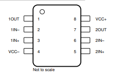
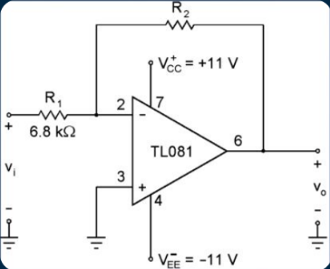
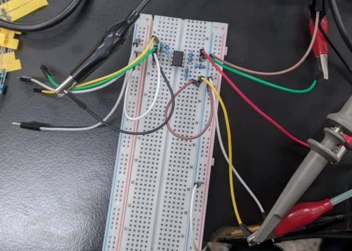
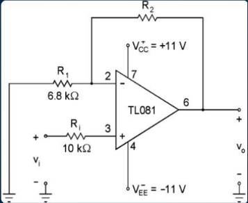

<!-- 

--- -->

# **$\color{#FFFFFF}\text{Amplificador Operacional}$**

---

## $\color{#00FF41}\text{Introducción}$
El Amplificador Operacional (OpAmp) es un dispositivo electrónico de alta ganancia, acoplado en corriente continua, que utiliza retroalimentación externa para controlar su respuesta. Surgió en la década de 1940, originalmente implementado con t|ubos de vacío para realizar operaciones matemáticas en computadoras analógicas. 

Físicamente, un OpAmp es un amplificador que consta de dos entradas (inversora y no inversora) y una salida. Se caracteriza por buscar el "ideal" teórico: una impedancia de entrada infinita (no consume corriente), una impedancia de salida de cero ohms y una ganancia de lazo abierto extremadamente alta. En esta práctica, se utiliza el TL082CP para configurar dos etapas fundamentales: la inversora y la no inversora, donde la ganancia final ($A$) depende exclusivamente de la relación entre las resistencias externas conectadas al circuito.

Para un amplificador inversor, la relación es:

$$V_{out} = AV_{in} = -\frac{R_N}{R_1}V_{in}$$

Mientras que, para un amplificador no inversor, está dada por:

$$V_{out} = AV_{in} = \left(1+\frac{R_N}{R1}\right)V_{in}$$

---

## $\color{#00FF41}\text{Objetivo}$
Realizar una amplificación con una ganancia de 10.

---

## $\color{#00FF41}\text{Metodología}$
Se utilizó el integrado _TL082CP_, el cual consta de dos amplificadores operacionales (opamps) en su interior ([Figura 1](#fig-pinout)). 

  
  
<b>Figura 1.</b> Pinout del TL082CP.

Uno de sus amplificadores se utilizó para crear un circuito de amplificador inversor y el otro para un circuito de amplificador no inversor.

Para ambos casos se utilizó un generador de señal para la señal de entrada, configurado en $100mV_{pp}$ @ 1kHz. Además de una fuente simétrica de $\pm12V$ para la **Añadir para qué sirve** del opamp. 

### **$\color{#C0C0C0}\text{Amplificador inversor}$**

Para el amplificador inversor se siguió el siguiente diagrama ([Figura 2](#fig-diagramaInversor)).

  <figure id="fig-diagramaInversor" style="text-align: center; width: 45%;">
    
    <figcaption><b>Figura 2a. </b><i>Diagrama del amplificador no inversor.</i></figcaption>
  </figure>

  <figure id="fig-conexionInversor" style="text-align: center; width: 45%;">
    
    <figcaption><b>Figura 2b. </b><i>Amplificador inversor montado en protoboard.</i></figcaption>
  </figure>

<b>Figura 2. </b>Amplificador Inversor

Como se buscaba tener una ganancia de 10, se le dio a R2 una resistencia de $68\text{k}\ohm$.

Finalmente, se realizaron las conexiones en la protoboard y para poder ver las señales tanto de entrada como de salida, y así poder compararlas, se conectó el generador de señales, la fuente simétrica y un osciloscopio en las terminales correspondientes ([Figura 3](#fig-conexionInversor)).

### **$\color{#C0C0C0}\text{Amplificador no inversor}$**
Para este caso se siguió el diagrama que se muestra en la [Figura 4](#fig-no_inversor)

  
  
<b>Figura 3.</b>Diagrama del amplificador no inversor.

Como también buscábamos una amplificación de 10, se optó por utilizar una resistencia de $6.2k\ohm$ para R2.

E igual que el caso anterior, se conectaron los aparatos necesarios para realizar la amplificación y la visualización de esta. 

---

## $\color{#00FF41}\text{Resultados}$

---

## $\color{#00FF41}\text{Conclusión}$

